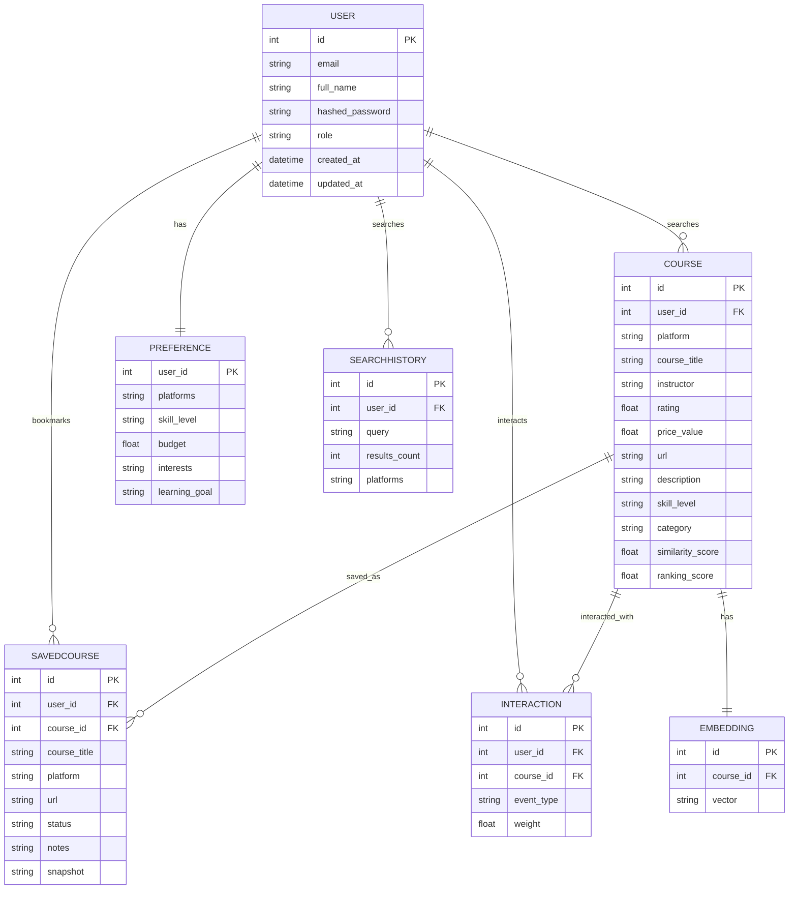

# Database

CourseIQ uses PostgreSQL (in Docker) or SQLite (local fallback) for data persistence, with SQLAlchemy as the ORM.

## Database Selection

| Environment | Database |
|-------------|-----------|
| Docker Compose | PostgreSQL 16 (port 5433) |
| Local Development | SQLite (fallback) |

### Docker Configuration

```yaml
# docker-compose.yml
services:
  db:
    image: postgres:16
    ports:
      - "5433:5432"
    environment:
      POSTGRES_DB: courseiq
      POSTGRES_USER: courseiq
      POSTGRES_PASSWORD: courseiq
```

## Database Models

### User

Stores user account information.

| Field | Type | Description |
|-------|------|-------------|
| `id` | Integer | Primary key |
| `email` | String | Unique email |
| `full_name` | String | User's full name |
| `hashed_password` | String | Encrypted password |
| `role` | String | User role |
| `created_at` | DateTime | Account creation timestamp |
| `updated_at` | DateTime | Last update timestamp |

### Course

Stores searchable course metadata from various platforms.

| Field | Type | Description |
|-------|------|-------------|
| `id` | Integer | Primary key |
| `user_id` | Integer | Foreign key to User |
| `platform` | String | Course platform (Coursera, Udemy, etc.) |
| `course_title` | String | Course title |
| `instructor` | String | Instructor name |
| `rating` | Float | Course rating |
| `price` | String | Price string |
| `price_value` | Float | Numeric price |
| `duration` | String | Course duration |
| `url` | String | Course URL |
| `description` | String | Course description |
| `skill_level` | String | Beginner/Intermediate/Advanced |
| `category` | String | Course category |
| `search_query` | String | Original search query |
| `image_url` | String | Course thumbnail |
| `similarity_score` | Float | Vector similarity score |
| `ranking_score` | Float | Final ranking score |

### SavedCourse

Tracks courses bookmarked/in-progress by users.

| Field | Type | Description |
|-------|------|-------------|
| `id` | Integer | Primary key |
| `user_id` | Integer | Foreign key to User |
| `course_id` | Integer | Foreign key to Course |
| `course_title` | String | Saved course title |
| `platform` | String | Platform name |
| `url` | String | Course URL |
| `status` | Enum | bookmarked/in_progress/completed |
| `notes` | String | User's notes |
| `snapshot` | JSON | Course data snapshot |

### UserPreference

Stores user preferences for course recommendations.

| Field | Type | Description |
|-------|------|-------------|
| `user_id` | Integer | Primary key/Foreign key to User |
| `preferred_platforms` | List | Preferred platforms |
| `skill_level` | String | Current skill level |
| `budget` | Float | Budget limit |
| `interests` | List | Interest tags |
| `learning_goal` | String | Learning objective |

### SearchHistory

Tracks user search history.

| Field | Type | Description |
|-------|------|-------------|
| `id` | Integer | Primary key |
| `user_id` | Integer | Foreign key to User |
| `search_query` | String | Search query |
| `results_count` | Integer | Number of results |
| `platforms_searched` | List | Platforms searched |

### Interaction

Records user interactions for recommendation training.

| Field | Type | Description |
|-------|------|-------------|
| `id` | Integer | Primary key |
| `user_id` | Integer | Foreign key to User |
| `course_id` | Integer | Foreign key to Course |
| `event_type` | Enum | search_click/bookmarked/in_progress/completed |
| `weight` | Float | Interaction weight |

### CourseEmbedding

Stores vector embeddings for semantic search.

| Field | Type | Description |
|-------|------|-------------|
| `id` | Integer | Primary key |
| `course_id` | Integer | Foreign key to Course |
| `vector` | JSON | Vector embedding array |

## Relationships



### Text Representation

```
User
├── 1:N Course (searched courses)
├── 1:N SavedCourse (bookmarks)
├── 1:1 UserPreference (settings)
├── 1:N SearchHistory
└── 1:N Interaction (events)

Course
├── 1:N SavedCourse
├── 1:N Interaction
└── 1:1 CourseEmbedding
```

## Schema Management

SQLAlchemy's `Base.metadata.create_all()` handles schema creation automatically on app startup.

### Migrations

For production, use Alembic migrations:

```bash
pip install alembic
alembic init alembic
alembic revision --autogenerate -m "Initial migration"
alembic upgrade head
```

## Query Patterns

### Two-Tenancy

All queries filter by `user_id` to ensure data isolation between users.

### Vector Embeddings

Course embeddings are stored as JSON arrays in the `CourseEmbedding` table for semantic similarity search.